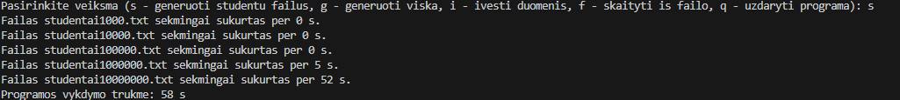
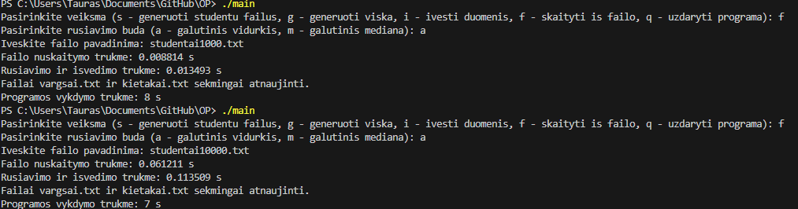

# OP
Objektinis Programavimas

Studentų pažymių failų kūrimo laikas:

| Nr.| studentai1000.txt       | studentai10000.txt   | studentai100000.txt   | studentai1000000.txt | studentai10000000.txt |
|----|-------------------------|----------------------|-----------------------|----------------------|-----------------------|
| 1  |  0s  |  0s  |  0s  |  5s  |  51s  |
| 2  |  0s  |  0s  |  0s  |  5s  |  52s  |
| 3  |  0s  |  0s  |  0s  |  5s  |  51s  |

Duomenų apdorojimas:

*Visos programos vykdymo trukmė įskaičiuoja ir naudotojo įvedimo laiką!!!

studentai1000.txt
| Nr.| nuskaitymo trukmė  | rūšiavimas ir išvedimas | Visos programos vykdymo trukmė | 
|----|--------------------|-------------------------|--------------------------------|
| 1  |  0.007263 s  |  0.022519 s  |  7 s  | 
| 2  |  0.006781 s  |  0.01229 s  |  8 s  |
| 3  |  0.005999 s  |  0.011557 s  |  6 s  |

studentai10000.txt
| Nr.| nuskaitymo trukmė  | rūšiavimas ir išvedimas | Visos programos vykdymo trukmė | 
|----|--------------------|-------------------------|--------------------------------|
| 1  |  0.071505 s  |  0.131852 s  |  10 s  | 
| 2  |  0.06434 s  |  0.118208 s  |  10 s  |
| 3  |  0.068058 s  |  0.116302 s  |  12 s  |

studentai100000.txt
| Nr.| nuskaitymo trukmė  | rūšiavimas ir išvedimas | Visos programos vykdymo trukmė | 
|----|--------------------|-------------------------|--------------------------------|
| 1  |  0.659162 s  |  1.33598 s  |  7 s  | 
| 2  |  0.657427 s  |  1.29775 s  |  6 s  |
| 3  |  0.67134 s  |  1.33554 s  |  6 s  |

studentai1000000.txt
| Nr.| nuskaitymo trukmė  | rūšiavimas ir išvedimas | Visos programos vykdymo trukmė | 
|----|--------------------|-------------------------|--------------------------------|
| 1  |  6.41818 s  |  14.8851 s  |  25 s  | 
| 2  |  6.32317 s  |  14.5601 s  |  24 s  |
| 3  |  6.39247 s  |  14.7934 s  |  25 s  |

studentai10000000.txt
| Nr.| nuskaitymo trukmė  | rūšiavimas ir išvedimas | Visos programos vykdymo trukmė | 
|----|--------------------|-------------------------|--------------------------------|
| 1  |  62.41891 s  |  148.8519 s  |  211 s  | 
| 2  |  63.2171 s  |  145.60158 s  |  209 s  |
| 3  |  63.92468 s  |  147.93469 s  |  212 s  |

